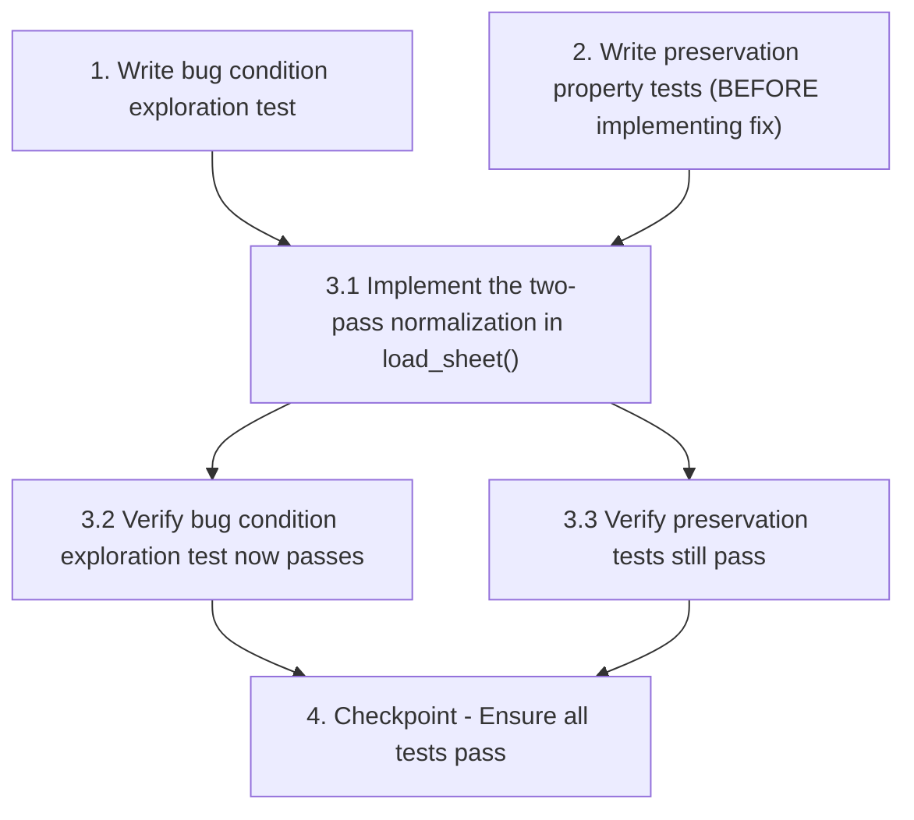

# Implementation Plan

## Overview

This task list implements the fix for animation frame bleeding, clipping, and jittering issues in the Pygame knight character by implementing a two-pass normalization approach in the `load_sheet()` function.

## Tasks

- [-] 1. Write bug condition exploration test
  - **Property 1: Bug Condition** - Frame Dimension Consistency
  - **CRITICAL**: This test MUST FAIL on unfixed code - failure confirms the bug exists
  - **DO NOT attempt to fix the test or the code when it fails**
  - **NOTE**: This test encodes the expected behavior - it will validate the fix when it passes after implementation
  - **GOAL**: Surface counterexamples that demonstrate the bug exists
  - **Scoped PBT Approach**: For deterministic bugs, scope the property to the concrete failing case(s) to ensure reproducibility
  - Test that Walk animation frames have inconsistent dimensions after cropping (from Bug Condition in design)
  - Test that Run Attack animation frames have inconsistent dimensions after cropping
  - Test that Attack 1 animation frames have inconsistent dimensions after cropping
  - Test that Jump animation frames have inconsistent dimensions after cropping
  - Measure frame dimensions for each animation and assert they are NOT all equal
  - The test assertions should verify that frames have identical dimensions (this will fail on unfixed code)
  - Run test on UNFIXED code
  - **EXPECTED OUTCOME**: Test FAILS (this is correct - it proves the bug exists)
  - Document counterexamples found (e.g., "Walk frame 0: 180x312, frame 1: 208x324, frame 2: 192x316")
  - Mark task complete when test is written, run, and failure is documented
  - _Requirements: 1.1, 1.2, 1.3, 1.4, 1.5, 1.6, 1.7, 1.8_

- [ ] 2. Write preservation property tests (BEFORE implementing fix)
  - **Property 2: Preservation** - Existing Functionality
  - **IMPORTANT**: Follow observation-first methodology
  - Observe behavior on UNFIXED code for animations that currently work correctly (Idle, Idle_2, Run, Roll, Block)
  - Measure frame dimensions for Idle animation on unfixed code and record them
  - Measure frame dimensions for Run animation on unfixed code and record them
  - Measure frame dimensions for Roll animation on unfixed code and record them
  - Measure frame dimensions for Block animation (single frame) on unfixed code and record them
  - Write property-based tests capturing observed behavior patterns from Preservation Requirements
  - Test that Idle animation frames maintain their current dimensions after fix
  - Test that Run animation frames maintain their current dimensions after fix
  - Test that Roll animation frames maintain their current dimensions after fix
  - Test that Block animation frame maintains its current dimensions after fix
  - Test that sprite scaling continues to work correctly (frames scaled by SPRITE_SCALE factor of 4)
  - Property-based testing generates many test cases for stronger guarantees
  - Run tests on UNFIXED code
  - **EXPECTED OUTCOME**: Tests PASS (this confirms baseline behavior to preserve)
  - Mark task complete when tests are written, run, and passing on unfixed code
  - _Requirements: 3.1, 3.2, 3.3, 3.4, 3.5, 3.6, 3.7_

- [ ] 3. Fix for animation frame bleeding and jittering

  - [ ] 3.1 Implement the two-pass normalization in load_sheet()
    - Add first pass: iterate through all frames to find maximum width and height after cropping
    - Store cropped frames in a list during first pass
    - Calculate max_width and max_height across all cropped frames
    - Add second pass: normalize all frames to max dimensions with baseline anchoring
    - Create normalized surface with max dimensions for each frame
    - Position each cropped frame with bottom alignment (y_offset = max_height - cropped.height)
    - Center each cropped frame horizontally (x_offset = (max_width - cropped.width) // 2)
    - Apply sprite scaling to normalized frames instead of cropped frames
    - Maintain existing error handling and function signature
    - _Bug_Condition: isBugCondition(input) where input.frames have inconsistent dimensions after cropping AND hasInconsistentFootPositions(input.frames) AND renderedWithMidbottomAnchoring(input.frames)_
    - _Expected_Behavior: All frames in an animation have identical dimensions with character's feet at the same relative position (bottom of frame)_
    - _Preservation: Animations that currently work correctly (Idle, Idle_2, Run, Roll, Block) must continue to display without new artifacts; midbottom anchoring, sprite scaling, animation offsets, flipping, collision detection, and gameplay mechanics must remain unchanged_
    - _Requirements: 1.1, 1.2, 1.3, 1.4, 1.5, 1.6, 1.7, 1.8, 2.1, 2.2, 2.3, 2.4, 2.5, 2.6, 2.7, 2.8, 3.1, 3.2, 3.3, 3.4, 3.5, 3.6, 3.7_

  - [ ] 3.2 Verify bug condition exploration test now passes
    - **Property 1: Expected Behavior** - Frame Dimension Consistency
    - **IMPORTANT**: Re-run the SAME test from task 1 - do NOT write a new test
    - The test from task 1 encodes the expected behavior
    - When this test passes, it confirms the expected behavior is satisfied
    - Run bug condition exploration test from step 1
    - **EXPECTED OUTCOME**: Test PASSES (confirms bug is fixed)
    - Verify Walk animation frames now have consistent dimensions
    - Verify Run Attack animation frames now have consistent dimensions
    - Verify Attack 1 animation frames now have consistent dimensions
    - Verify Jump animation frames now have consistent dimensions
    - _Requirements: 2.1, 2.2, 2.3, 2.4, 2.5, 2.6, 2.7, 2.8_

  - [ ] 3.3 Verify preservation tests still pass
    - **Property 2: Preservation** - Existing Functionality
    - **IMPORTANT**: Re-run the SAME tests from task 2 - do NOT write new tests
    - Run preservation property tests from step 2
    - **EXPECTED OUTCOME**: Tests PASS (confirms no regressions)
    - Verify Idle animation frames maintain correct dimensions
    - Verify Run animation frames maintain correct dimensions
    - Verify Roll animation frames maintain correct dimensions
    - Verify Block animation frame maintains correct dimensions
    - Verify sprite scaling still works correctly
    - Confirm all tests still pass after fix (no regressions)
    - _Requirements: 3.1, 3.2, 3.3, 3.4, 3.5, 3.6, 3.7_

- [ ] 4. Checkpoint - Ensure all tests pass
  - Run all bug condition tests and verify they pass
  - Run all preservation tests and verify they pass
  - Visually test Walk animation in game to confirm smooth display without jitter
  - Visually test Run Attack animation in game to confirm smooth display
  - Visually test Jump animation in game to confirm smooth display
  - Verify no regressions in other animations (Idle, Run, Roll, etc.)
  - Ensure all tests pass, ask the user if questions arise

## Task Dependency Graph

## Notes

- Task 1 is expected to FAIL on unfixed code - this confirms the bug exists
- Task 2 should PASS on unfixed code - this establishes the baseline to preserve
- Task 3.1 implements the actual fix using two-pass normalization
- Tasks 3.2 and 3.3 verify the fix works and doesn't break existing functionality
